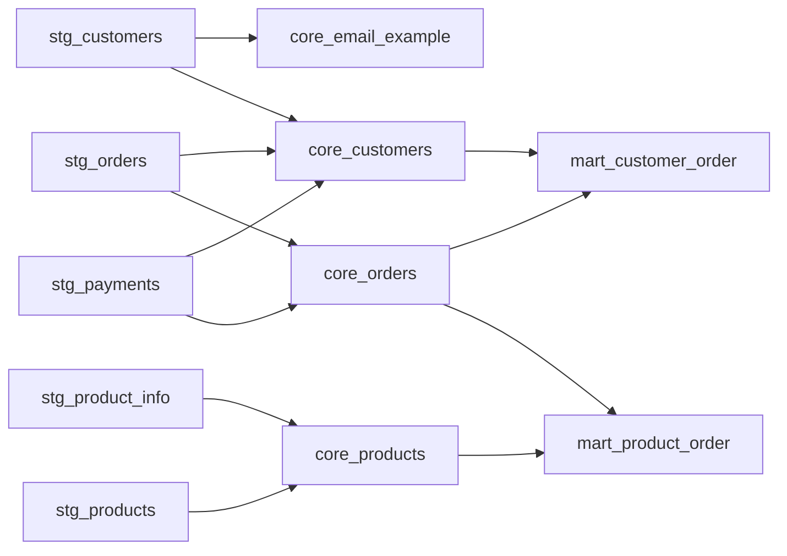

# Example sql files

These are just example sql files to show how the script works. Most of them are taken from [dbt's jaffle shop example](https://github.com/dbt-labs/jaffle_shop_duckdb/tree/duckdb).
Edited slightly. No expectation for the sql to work, basically just need a few `table.sql` and `table.yml` files with them referencing one another

## Lineage
lineage looks something like below.

